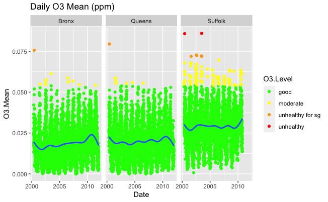
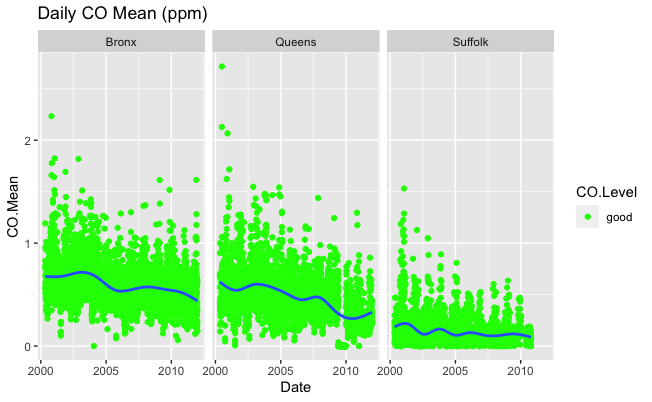
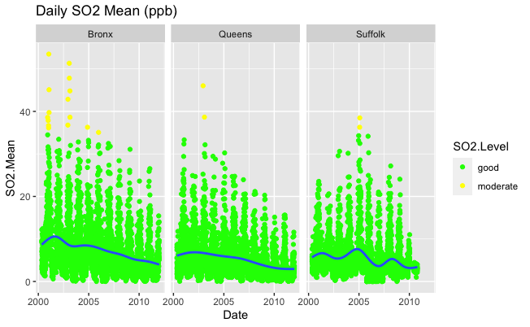
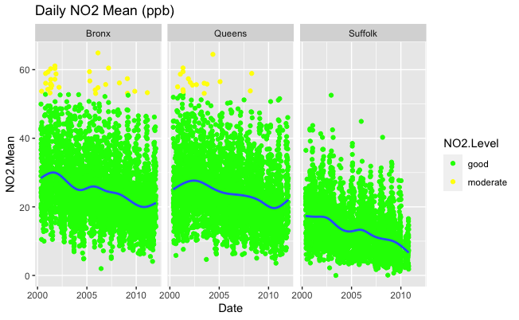
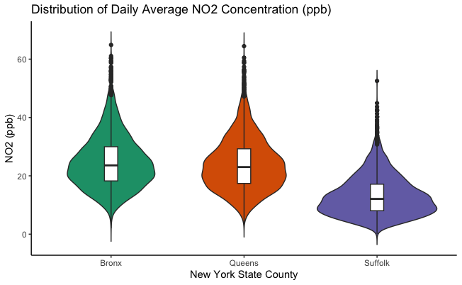
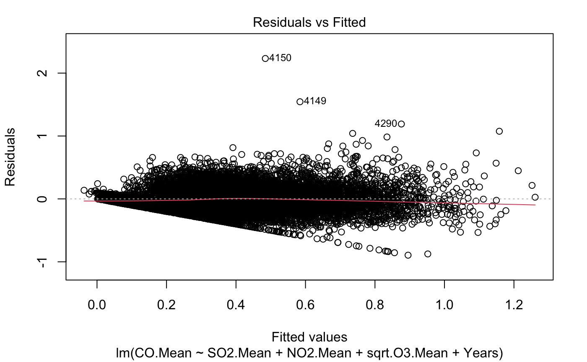
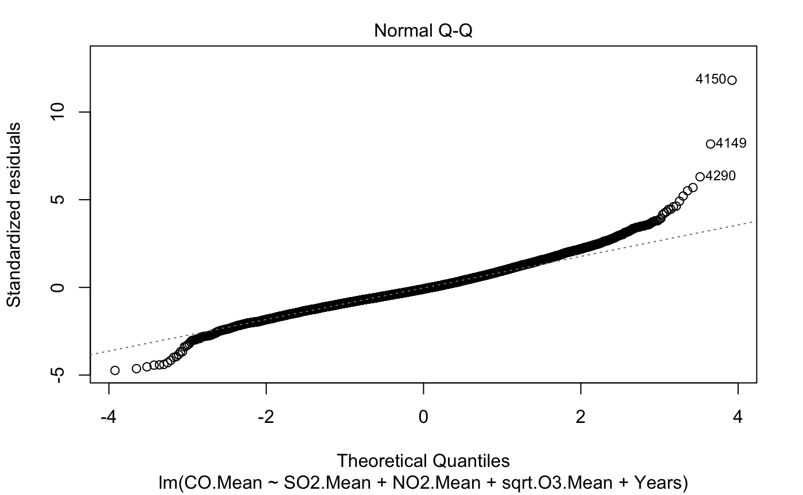
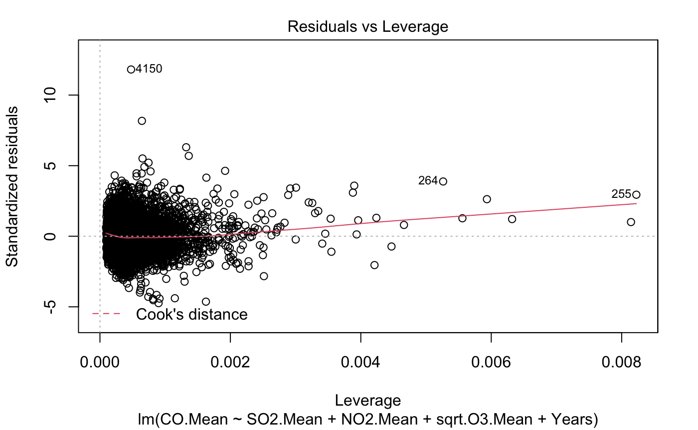
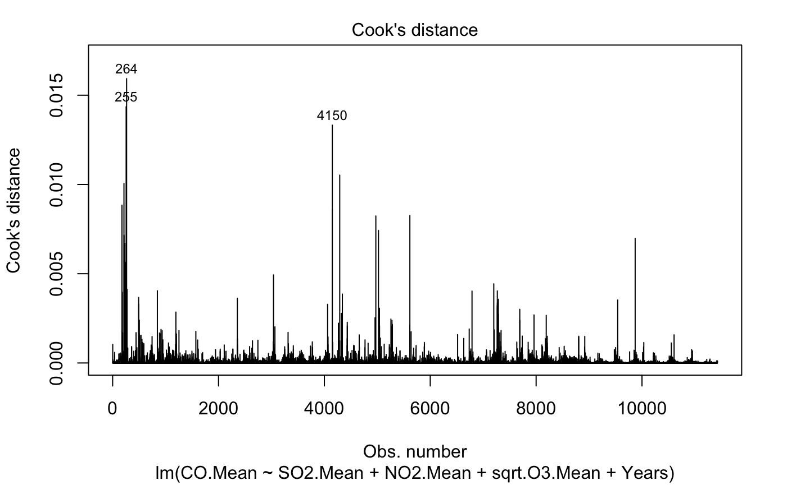

# 1 Introduction

Pollution and air quality can be easily measured across the U.S by measuring the amount of $O_3$, $NO_2$, $CO$, and $SO_2$ in the air. $CO$ accounts for a small amount of the EPA's air quality index, AQI, calculation. However, $CO$ concentration comes primary from car emission and the burning of fossil fuels whereas the $NO_2$, $SO_2$, and $O_3$ are all created from burning fossil fuels. $SO_2$ concentration increases with natural volcanic activity and the amount of $O_3$ in the air increases with car transmissions, chemical plants, etc. Many urban areas and areas near roadways have high AQIs. Studies have shown that living in areas with a high AQI has negative health effects. Historically, the areas near roadways, factories, etc. were deemed undesirable. This meant that low income communities, which due to institutionalized racism are often predominately people of color, were pushed into these undesirable areas. I decided to look at the air pollution in New York City and Long Island. This meant that I was looking at data from the Bronx, Queens, and Suffolk County. The Bronx is surrounded by numerous highways that are seemingly always gridlocked as well as heavy industry. The Bronx has even earned the nickname "Asthma Ally" with "five times the national average and at rates 21 times higher than other NYC neighborhoods" for asthma hospitalizations (Kilani). In Queens, the power plants located on the East River cause the AQI to increase for people living in the north-western part of the Burough. There is also a considerable amount of highways and traffic entering Queens on a daily basis with every commuter from Long Island passing through the borough to enter into Manhattan. While the Bronx is predominately people of Color, Queens and Suffolk county are highly segregated by income, race, and ethnicity. Through segregationist policies from the Jim Crow era until today, Queens and Suffolk County have pushed low income communities into areas highly polluted areas. Through this dataset, I wanted to explore if predicting the amount of $CO (ppm)$ would become more or less accurate with the addition of the County where the observation was taken from. I also wanted to see if we could predict whether or not an observation was from Suffolk county. I I also wanted to look at the trends in concentrations of these pollutants over the years. As climate change continues, I wanted to look in to the past, 2000-2011, to see if I could create a model to predict the average daily $CO$ concentration. This will serve as an accuracy test since this dataset does not contain data past this point. If the dataset did contain up until current day, we could use this model and analyze the accuracy of predicting and modeling the future. 

# 2 Data Discription

The dataset that I used was from [Katagle](https://www.kaggle.com/datasets/sogun3/uspollution). It was created by BrendaSo who compiled the data from the U.S. EPA's database. The dataset represents measurements taken every hour across the U.S. The dataset contains 70,487 measurements in total, the New York measurements are from January 1st, 2000 up until April 30th, 2016. The dataset has the following variables 

*  X - the row that each measurement represents (starts at zero)  
* State.Code - the code for the state that the measurement was made in
* County.Code - the code for the county that the measurement was made in 
* Site.Num - number of the site that the measurement was made in 
* Address - address of the site that the measurement was made in 
* State - state the measurement was made in 
* City - city the measurement was made in 
* Date.Local - year-month-day measurement was made
* NO2.Units - each $NO_2$ measurement is in parts per billion
* NO2.Mean - the mean of $NO_2$ measurements of that day
* NO2.1st.Max.Value - the largest $NO_2$ measurement taken on that day
* NO2.1st.Max.Hour - hour the largest $NO_2$ measurement of the day occurred 
* NO2.AQI - average $NO_2$ air quality index of that day 
* O3.Units - each $O_3$ measurement is measured in parts per million 
* O3.Mean - the mean of $O_3$ measurements taken on that day 
* O3.1st.Max.Value - the largest $O_3$ measurement taken on that day 
* O3.1st.Max.Hour - hour the largest $O_3$ measurement of the day occurred 
* O3.AQI - average $O_3$ air quality index of that day 
* SO2.Units - each $SO_2$ measurement is in parts per billion 
* SO2.Mean - the mean of $SO_2$ measurements taken on that day 
* SO2.1st.Max.Value - the largest $SO_2$ measurement taken on that day 
* SO2.1st.Max.Hour - hour the largest $SO_2$ measurement of the day occurred 
* SO2.AQI - average $SO_2$ air quality index of that day
* CO.Units - each $CO$ measurement is in parts per million 
* CO.Mean - the mean of $CO$ measurements taken on that day
* CO.1st.Max.Value - the largest $CO$ measurement of the day 
* CO.1st.Max.Hour - hour the largest $CO$ observation of the day occurred
* CO.AQI - average $CO$ air quality index of that day  

# 3 Exploratory Data Analysis

For this project, I filtered the data to only include observations that were taken in New York state. I also converted `Local.Date{r}` from type  `string` to type `Date`. First, I calculated the average $SO_2$, $NO_2$, $CO$, and $O_3$ observation for each day. Since the data from Suffolk County only ranges from 2000-01-01 to 2011-12-31;the Bronx data from 2000-05-05 to 2016-04-03; and the Queens from 2000-01-01 to 2016-04-03. I looked at observations between 2000-05-05 and 2011-12-31. 

First I looked at the AQI for each of the pollutants. $CO$ and $SO_2$'s AQI had 3528 and 35244 null points respectively. I decided to disregard the AQI and to do my data analysis on the daily average values of $SO_2$, $NO_2$, $CO$, and $O_3$ measurements in each county. The AQI is calculated by looking at the average pollutant concentration over 8 hour or 1 hour periods. We are not loosing any information by not considering the AQIs of each pollutant as we could calculate them from the remaining data. So I added in a column for each pollutant that indicates whether the corresponding concentration was at good, moderate, unhealthy for some groups, unhealthy, very unhealthy, or hazardous level according to [AirNow] (https://www.airnow.gov/sites/default/files/2020-05/aqi-technical-assistance-document-sept2018.pdf). 

First I decided to look at the daily concentration of each pollutant within each county. We see that the Daily $O_3$ concentration is follows similar trends and is approximately the same concentration in the Bronx and Queens, and Suffolk County has a higher concentration. In Suffolk County we see an increasing trend in $O_3$ concentration whereas in the Bronx and Queens it is decreasing. Next, I looked at daily mean $NO_2$ concentration. All counties show an overall decreasing trend in daily $NO_2$ Mean. However, Suffolk County starts at a much lower daily concentration has a greater difference in average daily concentration compared to the Bronx and Queens. I then looked at the daily average concentration of $SO_2$ which in all counties decreased overtime. We see that in Suffolk County there was some periodic trend that is not shown in the Bronx or Queens. Finally, I looked at the daily average $CO$ concentration in each county. There is not an overall decrease in any county, however, the average daily concentration of $CO$ starts much lower in Suffolk county compared to the Bronx and Queens. Queens and the Bronx also show that their daily average concentration of $CO$ is decreasing faster than Suffolk County; however, Suffolk County always remains less than their average daily concentration of $CO$.

   

Now we can look at the distribution of each pollutant within each county. First I looked at the daily average $CO$ concentration in each county. We can see that Suffolk county has highly skewed data with their median and third quartile values being less that the first quartiles of the Bronx and first quartile value of Queens. The Bronx appears to have a fairly symmetric distribution, but does appear to have two peaks, so it could be a bimodal distribution. 

 
We can then look at the distribution of $SO_2$ concentration in each county. Each county has right skewed data with a large number of outliers It also appears that their median and quartile ranges are fairly similar, unlike $CO$ concentration above. 
 
 
  
 
Observing the $NO_2$ concentration in each county, we see that the Bronx and Queens appear to be fairly symmetric with similar quartiles and medians. Suffolk county is skewed to the right andits median is less than that of Queens and the Bronx. 
 
 
 
Looking at the $O_3$ concentrartions in each county, we see that each county's distribution is fairly symmetric. Queen sand the Bronx appear to be very similar, just like the $NO_2$ concentration figure above. Suffolk County has higher values of daily average $O_3$ concentration with its first quartile being above the medians of the Bronx and of Queens. 
 

# 4 Model Diagnostics and Influential Observations

After looking at the violin plot of the daily average $CO$ measurement in each county, I ran a standard OLS model to predict the daily average $CO$ observation with the covariates
$SO_2$, $O_3$, and $NO_2$ daily averages, years from 2000, and county (the county variable was dummified and the Bronx was used as a reference point). After analyzing the distributions of each of the covariates, I noticed that the daily $O_3$ averages were right skewed.

To linearize the data, I used the square root of each daily average $O_3$ concentration value. The other covariates remained the same. I noticed that there were a lot of outliers within each county's daily average $CO$ distribution, so I calculated the leverage score for each daily $CO$ observations. I used the formula $h_{i} = (X(X^TX)^{-1}X^T)_{i,i}$ which correlates a high leverage score with the points that are vary far from the usual values of average $CO$ concentration given the covariates. I determined that 480 out of the 11426 total data points had a high leverage score. I decided to look into this further and see which of these points could influence our prediction and calculated the studentized residuals from my OLS model using the formula $\tilde{e_i} \sqrt{\frac{n - (p + 1) - 1}{n - (p + 1) - \tilde{e_i}^2}}$ where $\tilde{e_i} = \frac{e_i}{\hat{\theta}\sqrt{(1 - h_i)}}$. When we calculate the studentized residuals and use the Bonferroni correction of $\frac{\alpha}{n}$ where $n$ is the number of data points and $\alpha$ is our significance value, here I used $\alpha = .05$ and assumed a t-distribut with $n - (p + 1)$ degrees of freedom. 

I did this to see if there are 480 points that had high leverage scores where true oddities. I concluded that only 22 were below the Bonferroni correction. This allows us to conclude that there are very few points that our prediction is signficantly incorrect about. However, we cannot conclude if the points are significantly large because our model is not correct or because of other factors that contributed to why the $CO$ mean was so high that day. 

# Model Interpretation and Inference

To look into our model further and see if it is not the most accurate. I ran the same standard OLS model but performed a 10 fold cross validation for predicting the daily agerage $O_3$ observation with the covariates $SO_2$, $\sqrt{O_3}$, and $NO_2$ daily average observations as well as the number of years from 2000 and the County. I then chose the model with the lowest cross validation mean squared error from forward AIC, 0.1266435; backward AIC, 0.1271926; forward BIC, 0.123597; and backward BIC, 0.1143419 I choose the model with the lowest cross validation mean squared error, backward BIC. Then using this model which excluded the dummified County variable, our model had an $RMSE = 0.189$ with 11421 degrees of freedom. We can then produce the following plots to further evaluate our model.

The residual plot does not appear to be a linear trend or follow a particular pattern. This provides evidence that our linear assumption is valid.There are some residuals that are very high, but that is expected as we calculated above that 480 points had high leverage scores and 21 of those predicted values were significantly different from our observed values (we found this above using the leverage score on Bonferroni correction) 

The qqplot shows heavily tailed data. Our residuals are larger than anticipated in the left and right tails. This underlines our assumption of normality since the variance is heteroskedastic. We could try using the `heavy` package in R to gain more accuracy. 

We can see in the two plots above describing each points relation to Cook's distance that there are few points higher Cook's distance values than others; however, these are not extreme Cook's distance values $(<= 0.5)$.

# 7 Conclusions

From our analysis of the pollution data in Southern New York state. We can see that the daily average $CO$ observations are are distributed differently in Suffolk, Bronx, and Queens. But if we want to predict the daily average $CO$ from the daily average measurements of $SO_2$, $O_3$, and $NO_2$, dates, and counties, a linear model is pretty accurate. Upon reviewing the violin plots, we can see in the $CO$ and $SO_2$ ones have a lot of outliers. However, there are only 29 data points that our linear model predicts significantly poorly. Some of these points are the ones with highlighted in the Cook's distance graphs. When we review the plots produced by the linear model, we can see that our assumption of homoskedasticity is invalid. We can transform the data or assume a different distribution of the errors to produce a more accurate model. Our observations and analysis of a simple linear model can provide us with an pretty accurate prediction of the daily average CO measurement. However, we could create a better model that does not violate our assumption of homoskedasticity. Our points of high leverage could also be from variables that are not accounted like the weather, cold and hot temperatures affect how much $CO$ is in the air. We also did not account for significant events. On 9/11, pollutents and dust filled the air. This could possibly account for some of the $CO$ daily averages that are so high and cause the high leverage points. After Hurricane Sandy, most New Yorkers living in Suffolk county could not drive or use power for weeks. There was a decrease in emissions from cars and power plants which could also account for some low values of daily $CO$ observations. The daily average $CO$ concentration in the air can be predicted using other pollutants and the county fairly accurately using linear regression. However, this could be improved with further analysis that aims to achieve homoskedacitiy of the residuals.

# 8 References
Kilani, H. (2009, Apr 4). 'Asthma alley': why minorities bear burden of pollution inequity caused by white people. \emph{The Guardian}. https://www.theguardian.com/us-news/2019/apr/04/new-york-south-bronx-minorities-pollution-inequity

https://www.airnow.gov/sites/default/files/2020-05/aqi-technical-assistance-document-sept2018.pdf

https://www.kaggle.com/datasets/sogun3/uspollution

